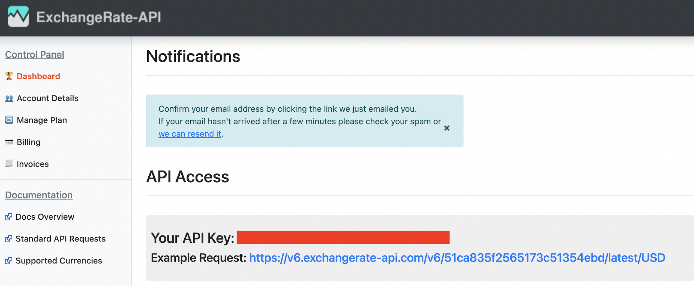
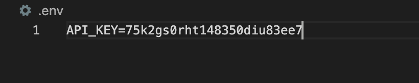

# _Scratch: A Currency Converter_

#### _A currency converter that allows a user to input any US dollar amount and see its exchange value_

#### By _**Chloe Loveall**_
<br>

 &nbsp;  &nbsp;  &nbsp;  &nbsp;  &nbsp; 

## Table of Contents

1. [Table of Contents](#table-of-contents)
2. [Description](#description)
3. [Demo/Preview](#demo/preview)
4. [Technologies Used](#technologies-used)
5. [Setup/Installation Requirements](#setup/installation-requirements)
    * [Installation](#installation)
    * [ExchangeRate-API Setup](#exchangerate-api-setup)
    * [API Security](#api-security)
6. [Specifications](#specifications)
7. [Known Bugs](#known-bugs)
8. [Contributing](#contributing)
9. [License](#license)
10. [Acknowledgements](#acknowledgements)
11. [Contact Information](#contact-information)

## Description

Scratch utilizes the ExchangeRate-API for currency conversion. Users can enter any US dollar amount (integers only) and receive the exchange rate of nearly any currency by inputting the necessary currency code. 
<br>
Currently, the North Korean Won (KPW) is unsupported. The following currencies experience heightened volatility & substantial differences between actual rates of exchange available in different markets and those published officially: 

* Libyan Dinar (LYD), Libya
* South Sudanese Pound (SSP), South Sudan
* Syrian Pound (SYP), Syria
* Venezuelan Bolívar Soberano (VES), Venezuela
* Yemeni Rial (YER), Yemen

## Demo/Preview

_Live preview on GH Pages: [gh-pages](https://chloeloveall.github.io/currency-exchanger/)_

## Technologies Used

* Bootstrap 4.6.0
* CSS3
* eslint 6.3.0
* ExchangeRate-API
* HTML5
* JavaScript ES6
* Jest 24.9.0
* jQuery 3.5.1
* Node Package Manager 6.14.9
* Postman 8.0.4
* webpack 4.39.3

## Setup/Installation Requirements

### Installation
* Clone the repository with the following git terminal command: ```$ git clone https://github.com/chloeloveall/currency-exchanger.git```
* Open the project directory in your terminal
* Confirm you have installed [Node](https://nodejs.org/en/download/) and [Node Package Manager](https://www.npmjs.com/get-npm)
* Recreate the project environment/install required dependencies by running the terminal command: ```$ npm install```
* Create the production environment by running the terminal command: ```$ npm run build```
* Open the project in the browser of your choice with the terminal command: ```$ npm run start```

### ExchangeRate-API Setup 
* Go to [ExchangeRate-API](https://www.exchangerate-api.com/) to sign up for a free account. This will allow you to acquire an API key (can be viewed through your account dashboard)
  

### API Security  
* Create a ```.env``` file in the root directory of the project.***
  * Copy the API key, API secret, and preset name from your ExchangeRate-API account and paste it into your ```.env``` file as shown below. The example below does NOT contain real or valid information and is for illustrative purposes only: 
  

***A ```.env``` file along with the ```dotenv-webpack``` will keep your API key secure. [Read more about API key security](https://www.learnhowtoprogram.com/intermediate-javascript/asynchrony-and-apis/managing-api-keys).

## Specifications

| Behavior                                                         | Input  | Output  |
| ---------------------------------------------------------------- | -----: | ------: |
| Return value of US dollar to EUR                                 |  1     | ~0.83   |
| Return user's inputted amount to EUR                             |  25    | ~20.63  |
| Returns error message if invalid currency code is entered        | ZZZ    | That is not a valid input. Please try again. |

## Known Bugs

* None at this time

## Contributing

Contributions are what make the open source community such an amazing place to be learn, inspire, and create. Any contributions you make are greatly appreciated.

1. Fork the project on GirHub
    * Follow [Installation/Setup Instructions](#setup/installation-requirements) above
2. Create your Feature Branch: ```$ git checkout -b YourFeatureBranchName```
3. Commit your Changes ```$ git commit -m 'Add some AmazingFeature'```
4. Push to your feature branch on Github ```$ git push origin YourFeatureBranchName```
5. Open a Pull Request

## License

[MIT](LICENSE.md)

## Acknowledgements

* [Shields](https://shields.io/)
* [Choose an open source license](https://choosealicense.com/)
* [GitHub Pages](https://pages.github.com/)

## Contact Information

_Chloe Loveall <chloeloveall@protonmail.com>_

 &nbsp;  &nbsp; 

[Back to Top](#table-of-contents)